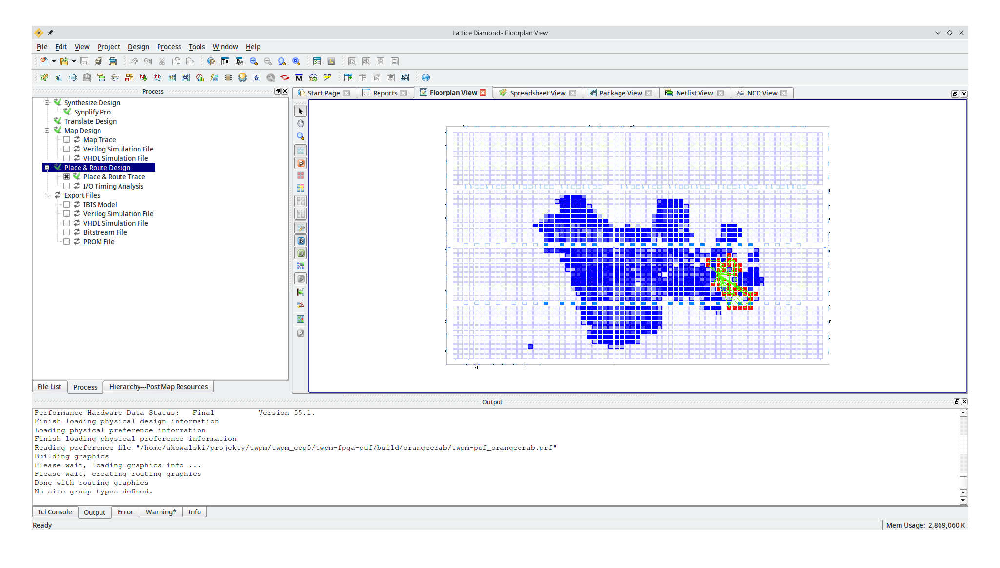
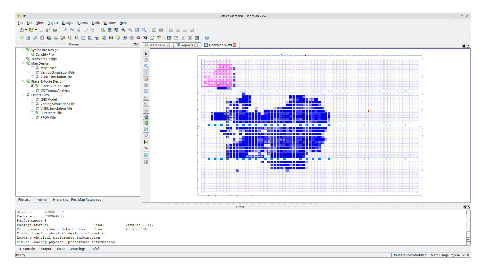

# TwPM PUF

## What is this

This is a failed attempt at implementing PUF (Physically Unclonable Function)
for [TwPM project](https://twpm.dasharo.com).

This repository contains code integrating RO (Ring Oscillator) PUF from
[stnolting/fpga_puf](https://github.com/stnolting/fpga_puf) and custom arbiter
PUF implementation.

The implementation was tested on Lattice ECP5
([OrangeCrab](https://orangecrab-fpga.github.io/orangecrab-hardware/)) using
both open-source tools (Yosys+nextpnr) and proprietary tools (Lattice Diamond).

## Status

RO PUF did not work as we expected, raw readings from PUF were very unstable,
making it impossible to reliably generate a stable and unique data. This issue
could be worked-around by using placement constraints in Lattice Diamond to
separate PUF from the rest of design, giving much better results, however this
could not be reproduced with Yosys and nextpnr.

Without placement constraints PUF is surrounded by other components, which could
interfere with ring oscillators.



This thesis may be supported by the fact that adding placement constraints:

```
UGROUP "PUF" BBOX 10 10 BLKNAME cpu/neorv32_top_inst/io_system.neorv32_cfs_inst_true.neorv32_cfs_inst/fpga_puf_inst;
LOCATE UGROUP "PUF" SITE "R2C2D" ;
```

so that PUF is separated from the rest of the design



gives much better results and we can generate a stable ID:

```
Select test mode:
 a - run quick test (execute 8 runs with 4096 ID samples each).
 b - compute hamming distance of raw IDs
starting test...
Run 0 ID: 0x1000000080148642254A0000
Run 1 ID: 0x1000000080148642254A0000
Run 2 ID: 0x1000000080148642254A0000
Run 3 ID: 0x1000000080148642254A0000
Run 4 ID: 0x1000000080148642254A0000
Run 5 ID: 0x1000000080148642254A0000
Run 6 ID: 0x1000000080148642254A0000
Run 7 ID: 0x1000000080148642254A0000
```

The ID is mostly reproducible. Running for a longer time causes some small
errors probably caused by rising temperature, however those errors could be
corrected by ECC.

However, most of bits are still unstable, out of 96 bits only 15 bits are stable
and the number is slowly decreasing over time, being 13 after 2,5k runs:

```
Run 2531: I=0x200004f04aa1280d0828a806, A=0x1a40010d111487724028aa12, B=0x649804c04820480801286026 - F=0xfff9e5ffdbfdef7fefbfff7f (83) - H(A,B)=44, H_max(A,B)=57 - H(I,A)=42, H_max(I,A)=55
Run 2532: I=0x200004f04aa1280d0828a806, A=0x1a40a0404aa0280d0828a806, B=0x6000a0400000405a43a25564 - F=0xfff9e5ffdbfdef7fefbfff7f (83) - H(A,B)=36, H_max(A,B)=57 - H(I,A)=12, H_max(I,A)=55
Run 2533: I=0x200004f04aa1280d0828a806, A=0x2000a0011014877243821568, B=0x1a40a0404aa0280d0828a806 - F=0xfff9e5ffdbfdef7fefbfff7f (83) - H(A,B)=47, H_max(A,B)=57 - H(I,A)=49, H_max(I,A)=55
Run 2534: I=0x200004f04aa1280d0828a806, A=0x649804c04020480a01286126, B=0x3000a0011014877247821560 - F=0xfff9e5ffdbfdef7fefbfff7f (83) - H(A,B)=41, H_max(A,B)=57 - H(I,A)=23, H_max(I,A)=55
Run 2535: I=0x200004f04aa1280d0828a806, A=0x300084d04aa0280d0028a806, B=0x6080a0410004465a03a25564 - F=0xfff9e5ffdbfdef7fefbfff7f (83) - H(A,B)=39, H_max(A,B)=57 - H(I,A)=5, H_max(I,A)=55
Run 2536: I=0x200004f04aa1280d0828a806, A=0x649884c00820480a01224124, B=0x380020051014876247821564 - F=0xfff9e5ffdbfdef7fefbfff7f (83) - H(A,B)=37, H_max(A,B)=57 - H(I,A)=28, H_max(I,A)=55
Run 2537: I=0x200004f04aa1280d0828a806, A=0x449804c04820480801286026, B=0x2000a0011014877247821548 - F=0xfff9e5ffdbfdef7fefbfff7f (83) - H(A,B)=46, H_max(A,B)=57 - H(I,A)=21, H_max(I,A)=55
```

> Note: the parameters shown in each line are:
> - **I** - initial reading from PUF
> - **A** and **B** - two consecutive readings from PUF
> - **F** - mask of noisy bits (and count of noisy bits in parenthesis)
> - **H(A,B)** - hamming distance between A and B
> - **H(I,A)** - hamming distance between I and A
>
> Also, please refer to https://github.com/stnolting/fpga_puf for description.

Overall results are still bad when compared to results described in
[stnolting/fpga_puf README.md](https://github.com/stnolting/fpga_puf?tab=readme-ov-file#reliability),
however it's much better than without constraints, when there were no stable
bits.

I tried to reproduce current results on open-source before going further.
Nexpnr doesn't support `UGROUP` directive - but supports
[BEL attribute](https://github.com/YosysHQ/nextpnr/blob/master/docs/constraints.md#absolute-placement-constraints).
There is also an largely undocumented feature, which allows to constrain cells
to specific region without giving absolute constraints for each cell. This can
be achieved passing custom python script (see [constrain_puf.py](constrain_puf.py))
as `--pre-pack` argument.

But, despite using both script-based and BEL attribute constraints we seen no
improvements with nextpnr and all PUF bits were noisy. By manually analysing
output of nextpnr (`.json` file) I saw that PUF was tightly surrounded by other
components. Unfortunatelly I couldn't get nextpnr's floorplan view to work
properly. I tried to constrain other components in order to make some distance
between PUF and the rest of the system, however I kept running into issues,
routing/placement failures, crashes, freezes.

Eventually, I gave up with, [stnolting](https://github.com/stnolting)'s design
and tried custom with arbiter PUF implementation.

## Arbiter PUF status


